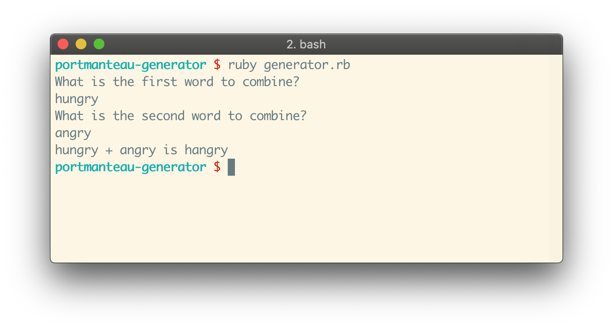
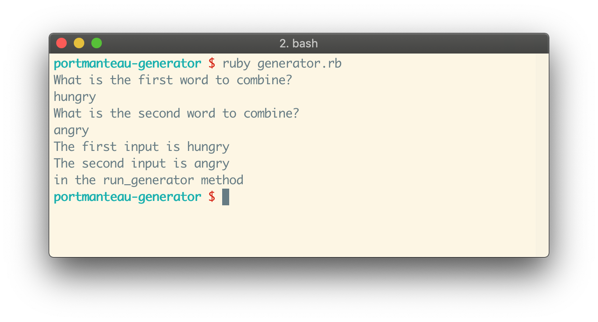
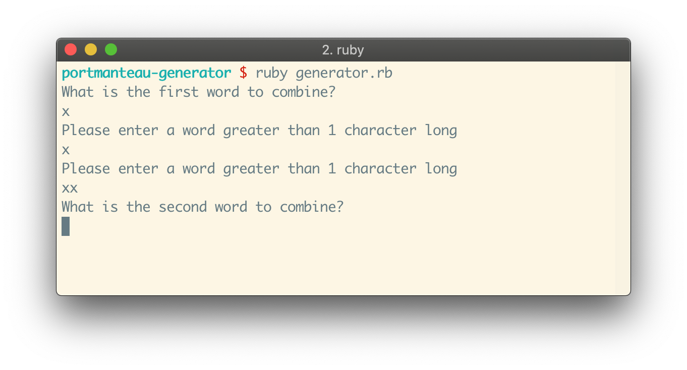

# Portmanteau Generator Exercise

## At a Glance

- Individual, [stage 1](https://github.com/Ada-Developers-Academy/pedagogy/blob/master/rule-of-three.md#stage-1) project
- Due before class, **Wed. Feb 6**

## Introduction

A [portmanteau](https://en.wikipedia.org/wiki/Portmanteau) is "a linguistic blend of words, in which parts of multiple words or their phones (sounds) are combined into a new word." Popular examples of portmanteau in English include:

- _smoke_ and _fog_ combine to create _smog_
- _jeans_ and _shorts_ combine to create _jorts_
- _breakfast_ and _lunch_ combine to create _brunch_
- _spoon_ and _fork_ combine to create _spork_
- _hungry_ and _angry_ combine to create _hangry_

## Learning Goals

- Write Ruby code with statements that practice conditional logic, using `if`, `elsif`, and `else` when appropriate
- Write Ruby code with statements that practice loops, like `while` and `until` when appropriate
- Write Ruby code that takes in user input using `gets.chomp`
- Practice creating, storing, and modifying variables
- Practice creating and using methods

## Objective

We will build a command line interface (CLI) program that allows any user to interact with the command line to perform simple manipulation of words and create portmanteaus. The program should ask the user to type in and enter in pieces of input. Based on the input that the user typed in, the program should output its evaluation.

The rules we will follow to create a portmanteau in this project are simplified and specific. Making portmanteaus in English is difficult and complex, so please follow the project specifications below closely. As a programmer, there's a balance between challenging assumptions and expectations and doing personal software design, versus fulfilling project requirements. Over time, we will have projects that require more programmer input and design. In this project, we will be asking you lean towards following the given rules.

## Getting Started

You should write your program as a series of statements within a file `generator.rb`. Anyone with this file should be able to run the command `$ ruby generator.rb` to run the program.

## Implementation Requirements

When a user runs this program, the program should politely ask the user for the following things:

1. a word to combine to begin the portmanteau
1. a second word to combine and end the portmanteau

Then, the program should use the two input words in to output and display the result of the following rules and create one portmanteau.

Here is an example of what your program could look like. It is not required to look exactly like this:



### Wave 1

In this wave, work on the following features:
- establishing the `run_generator` method
- getting all of the input needed
- storing those pieces of input into variables
- being able to print out those variables
- iterating through individual characters in words to check which characters are vowels

#### `run_generator` method

Make a method named `run_generator`. This method has no parameters. Start this method by outputting a prompt to ask for a first input word A, and accept some input. Then, ask for a second input word B, and accept some input.

Make sure you save these inputs into variables. Then, output these variables by printing them to the console, and the statement `"in the run_generator method"`.

Then, _call_ or _invoke_ the `run_generator` outside of the method definition, at the bottom of the `generator.rb` file.

Confirm that this is all setup by running `$ ruby generator.rb`, and make sure you can input two words, and you eventually see the statement `"in the run_generator method"` in the console.



#### `is_vowel?` method

Next, make a method named `is_vowel?`. This method should:
- take in one argument, a string, which will represent one letter. Name this argument `letter`
- return either `true` or `false`-- true if it is either the letters `a`, `e`, `i`, `o`, or `u`, false if it is anything else
- be defined above the definition for the `run_generator` method, in the same `generator.rb` file

Test that this method works by calling it inside of the `run_generator` method, and passing in some test cases, and printing the result to the console. Here is an example of what that might look like:

```ruby
def run_generator
  # ... maybe some other code ...

  test_vowel = "i"
  puts "Is #{test_vowel} a vowel?"
  puts is_vowel?(test_vowel)

  test_consonant = "g"
  puts "Is #{test_consonant} a vowel?"
  puts is_vowel?(test_consonant)  ...

  # ... maybe some other code ...
end
```

### Wave 2

In wave two, work on combining the first two input words using the rules below. They are broken up into the groups "Input validation rules" and "combination rules."

#### Before you start

Before you start wave 2, do the following things:

1. Read through all of the rules in both groups
1. Write down any questions you have
1. Talk about the rules with someone around you
1. Ask for further clarification, if needed
1. Ruby has a great built-in way to iterate through characters in a String using the method named `each_char`. Read through the [documentation for `each_char`](https://ruby-doc.org/core-2.1.0/String.html#method-i-each_char), and work through some examples in `irb`. What does `"hello world".each_char {|letter| print "#{letter} :) " }` do?
1. Make a strategy. Break down the parts. What rules translate into loops? What kind of loops? What rules translate into conditionals? What kinds of conditionals? Don't spend more than 15 minutes on this, moving to the next step is usually more helpful
1. Write pseudocode
1. Write code!

#### Input validation rules

- The input for the first word must be at least two characters. If the input is less than 2 characters (as in 0 or 1 characters), the program should handle it in the following procedure:
  - output a message to the command line that informs the user that the input was invalid and must be at least 2 characters
  - asks the user to re-enter the input for the same prompt
  - does this until the input is valid
  - uses the newer, valid input
- The input for the second word must be at least two characters. Follow the same guidelines as for the first word



There is no requirement that either input must have any specific number vowels or consonants to be valid.

There is no requirement that inputs must be upper or lowercase.

#### Combination rules

- Vowels in this program are the following letters: `a`, `e`, `i`, `o`, or `u`, and nothing else
- In the first word, find the last instance of a vowel. The first half of the portmanteau will keep every letter of the first word until and **excluding** its last vowel.

  For example, if the first word is `dreams`, then `a` is the last vowel in this word. The first part of the new portmanteau is `dre`, excluding the `a`
- In the second word, find the first instance of a vowel. The second half of the portmanteau will keep every letter of the second word after and **including** its last vowel.

  For example, if the second word is `hopes`, then `o` is the first vowel in this word. The second part of the new portmanteau is `opes`, including the `o`
- If there are no vowels found in the first word, _use every letter in the first word_ in the first part of the portmanteau.

  For example, if the first word is `sky`, then there are no vowels to consider. The first part of the new portmanteau is `sky`
- If there are no vowels in the second word, _use every letter in the second word_ in the second part of the portmanteau.

  For example, if the second word is `myth`, then there are no vowels to consider. The second part of the new portmanteau is `myth`

Then, combine the two parts. That's all there is to it!

We are ignoring complex rules in this project, because languages are complex! Do not worry about cases such as many vowels in a row, and just rely on the rules outlined above.

#### Examples

| Input Word A | Input Word B | Output | Description
|---|---|---|---|
| dog | cat | dat
| cat | dog | cog
| hungry | angry | hangry
| jean | shorts | jeorts
| spoon | fork | spoork
| breakfast | lunch | breakfunch
| aa | dog | aog | first is all vowels
| dog | aa | daa | second is all vowels
| xx | dog | xxog | first is all consonants
| dog | xx | dxx | second is all consonants
| aa | xx | axx | first is all vowels, second is all consonants
| xx | aa | xxaa | first is all consonants, second is all vowels
| xx | zz | xxzz | both are all consonants
| aa | ee | aee | both are all vowels

Edge cases:

| Input Word A | Input Word B | Output | Description
|---|---|---|---|
| 1111 | 2222 | 11112222 | both inputs are digits
| !!!! | @@@@ | !!!!@@@@ | both inputs are symbols
| dog | !!!! | d!!!! | second input is entirely non-letter characters
| !!!! | dog | !!!!og | first input is entirely non-letter characters
| dog | c!a!t | da!t | second input is combination of letter and non-letter characters
| d!o!g | cat | d!at | first input is a combination of letter and non-letter characters

Any set of inputs/output not covered in this table is not required to implement/or has no specific requirement of how to handle.

## Testing and Verification Requirement

Before project submission, test and verify that your program works as expected with the following testing/verification requirements.

To make sure your program works you will need to run your program and check against the following criteria:

- use the example table above
- make sure that it still works regardless of uppercase/lowercase letters
- make sure that the program works as expected if you give 0 or 1 character prompts **multiple times in a row**

## Optional Enhancements

The following is a list of optionals. Should you be ambitious to continue working on this project beyond the requirements, here is a list of features that are interesting. These enhancements are not listed in any particular order; feel free to pick an enhancement from anywhere in the list!

- After running the portmanteau generator, the program should ask if the user wants to continue. The program should accept input, and if the answer is "`yes`", then the program restarts
- Gracefully handle user input that does not contain a vowel, so that only words with at least one vowel are accepted. Do so with the following method:
  - output a message to the command line that informs the user that the input was invalid
  - asks the user to re-enter the input for the same prompt
  - does this until the input is valid
  - uses the newer, valid input
- There are other ways to iterate through strings letter-by-letter besides using `each_char`. Research other ways to do this, and refactor your code to use one of these ways
- Refactor more pieces of code into other helper methods

Please note that you will only be graded on the requirements, and not on the optional enhancements.

## What Instructors Are Looking For

Check out the [feedback template](feedback.md) which lists the items instructors will be looking for as they evaluate your project.
